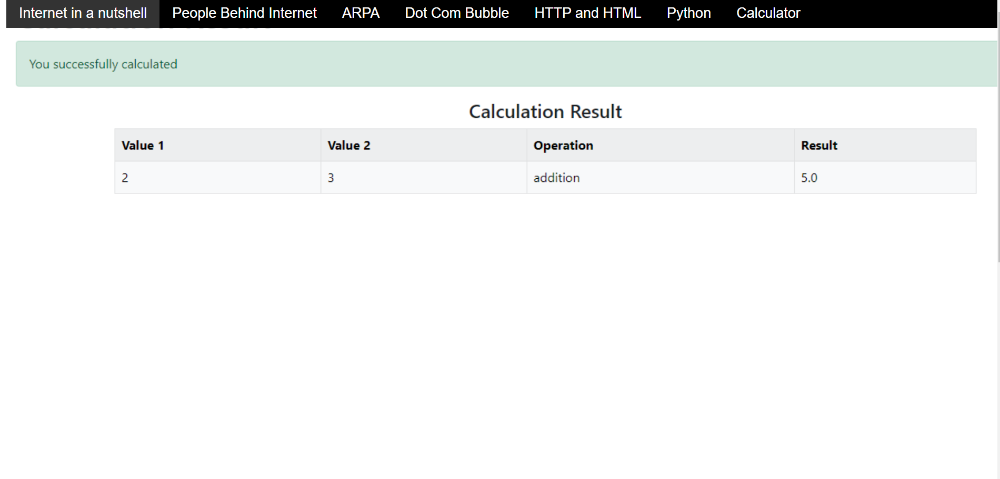
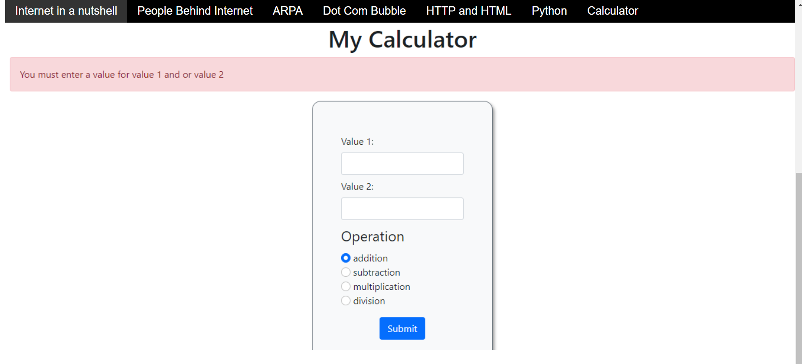
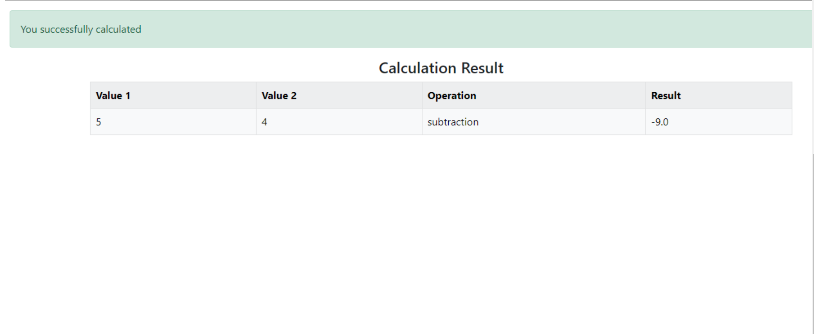
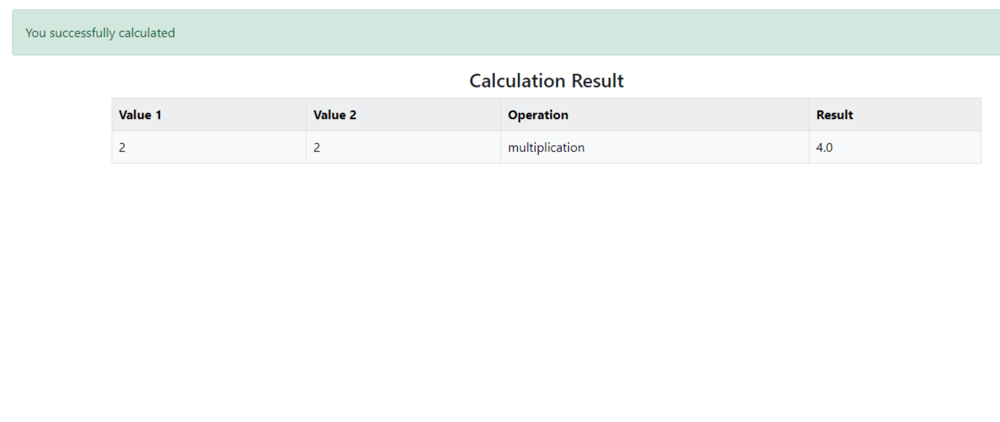
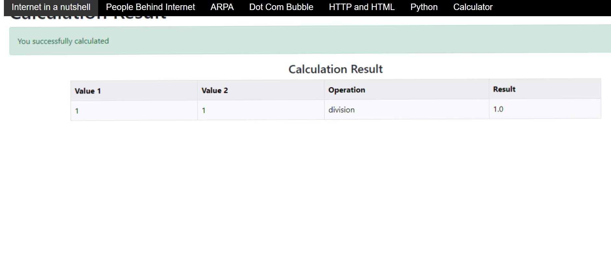
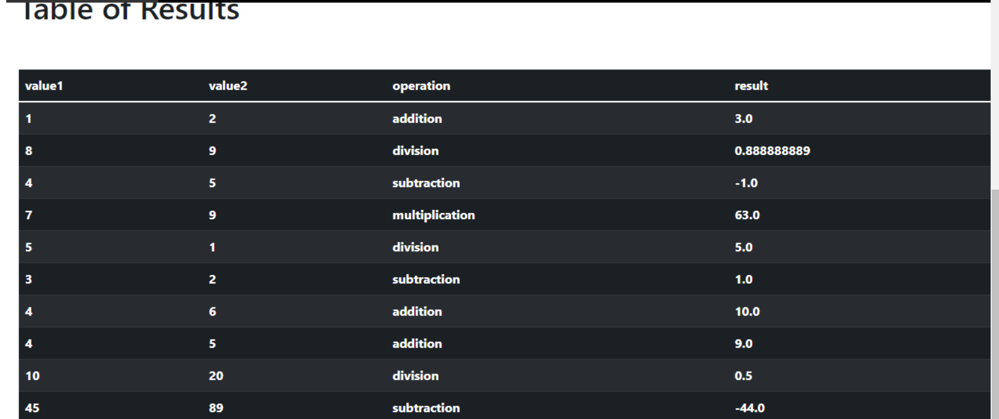

# Calculator Project Setup

# Calculator Project 3

### -Done by Swathi Venkatesh Kumar
#Calculator home page

#addition page

#addition result

#flash messages

#subtraction result

#multiplication result

#division result

#tables

