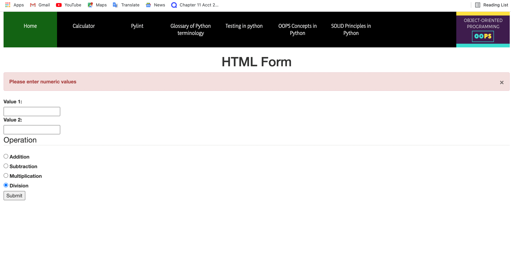
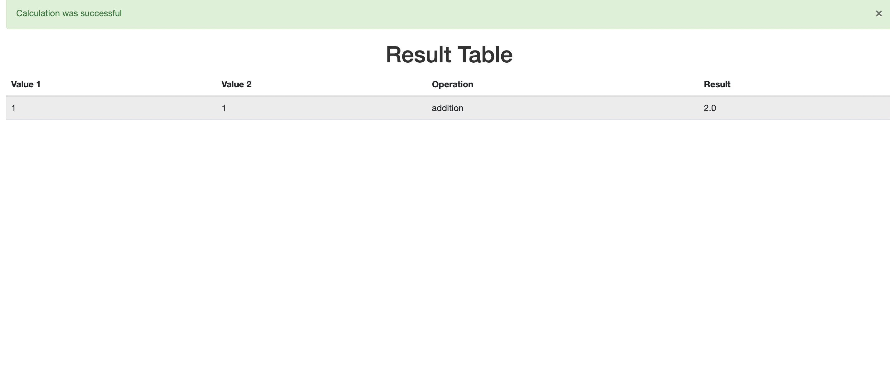

# Calculator Project Setup

Run Pip Install
pip install -r requirements.txt

To run tests, Lint, and Coverage report use this command:

pytest  --pylint --cov

.pylintrc is the config for pylint
.coveragerc is the config for coverage
setup.py is a config file for pytest

## My Calculator page image 

## Flash message when no values are entered 

## Using html pattern for input validation for non-numeric entries 

## Showing Flash messages are dismissable 
 

## Result table after operation is performed for normal and exceptions 

